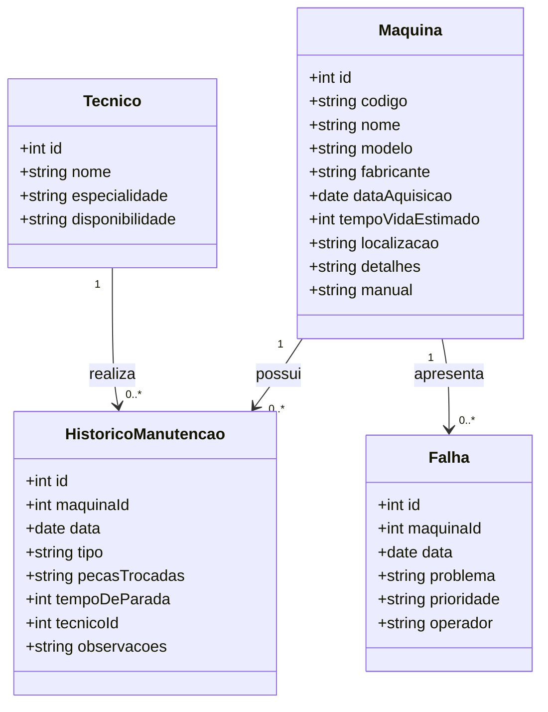

# Documentação Técnica do Projeto: Sistema de Manutenção

## Sistema de Manutenção Preventiva e Corretiva

### 1. Definição do Tema
O Sistema de Manutenção Preventiva e Corretiva é um software destinado ao gerenciamento do ciclo de vida de máquinas e equipamentos industriais, com foco em minimizar o tempo de inatividade e otimizar a performance operacional. Ele permite o controle das manutenções preventivas (realizadas regularmente para evitar falhas) e corretivas (realizadas após uma falha). O sistema também inclui funcionalidades para registrar falhas, gerenciar técnicos, gerar relatórios e acompanhar indicadores de desempenho, como o MTTR (Mean Time to Repair - Tempo Médio de Reparo) e o MTBF (Mean Time Between Failures - Tempo Médio Entre Falhas).

### 2. Análise de Requisitos e Escopo

#### Funcionalidades Principais:

- **Gerenciamento de Máquinas e Equipamentos:**
  - Cadastro de máquinas, incluindo especificações técnicas, data de aquisição e localização.
  - Visualização e edição de informações de máquinas.

- **Registro e Controle de Manutenções:**
  - Registro de manutenções preventivas e corretivas.
  - Histórico completo de manutenções para cada máquina.
  - Registro de peças substituídas e tempo de inatividade.

- **Gerenciamento de Falhas:**
  - Registro de falhas ocorridas, classificando a severidade e identificando o operador.
  - Controle de falhas por máquina.

- **Gerenciamento de Técnicos:**
  - Cadastro de técnicos, incluindo suas especialidades e disponibilidade.

- **Relatórios e Indicadores:**
  - Geração de relatórios de manutenção, tempo de inatividade, falhas e peças trocadas.
  - Cálculo de indicadores como MTTR e MTBF.

- **Integração com API:**
  - Utilização de uma API REST (JSON-Server) para armazenar e recuperar dados.

#### Requisitos Funcionais:
- O sistema deve permitir o cadastro de máquinas com suas especificações.
- O sistema deve registrar manutenções preventivas e corretivas, associando técnicos e peças trocadas.
- O sistema deve gerar relatórios de manutenção e indicadores de performance.
- O sistema deve oferecer uma interface gráfica intuitiva para o usuário final.

#### Requisitos Não Funcionais:
- O sistema deve ser responsivo, com tempo de resposta rápido ao realizar operações com a API.
- A interface deve ser amigável e permitir fácil navegação entre as funcionalidades.
- O sistema deve armazenar e recuperar dados de maneira segura e eficiente.

### 3. Escopo do Projeto

#### Objetivos:
- Desenvolvimento da interface gráfica (Swing) para o gerenciamento de máquinas, técnicos e manutenções.
- Implementação de funcionalidades CRUD para máquinas, manutenções, falhas e técnicos.
- Geração de relatórios com base nos dados registrados, incluindo indicadores de desempenho.
- Conexão com API para armazenar e manipular dados em tempo real.
- Validação e testes para garantir a robustez do sistema.

#### Levantamento de Recursos:
- Equipe de desenvolvimento (programadores, designers, testadores).
- Ferramentas de desenvolvimento (IDE, controle de versão, etc.).
- Servidor para hospedagem da API.

#### Análise de Riscos:
- **Integração com a API:** Realizar testes de integração contínua para identificar problemas o quanto antes. Documentar a API para facilitar a comunicação entre desenvolvedores.
- **Validação de Dados:** Implementar validações robustas tanto no front-end quanto no back-end para garantir a integridade dos dados.
- **Atrasos no Cronograma:** Utilizar metodologias ágeis, como Scrum, para permitir ajustes rápidos e garantir a entrega em tempo hábil.


### 4. Modelagem do Sistema

#### Diagrama de Classes
- **Máquinas:** Representa a máquina ou equipamento industrial que será gerenciado.
- **Manutenções:** Registra as manutenções realizadas nas máquinas, sejam preventivas ou corretivas.
- **Técnicos:** Representa o técnico responsável pela execução das manutenções.
- **Falhas:** Registra falhas ou problemas ocorridos em uma máquina.

#### Diagrama de Sequência (Uso e Fluxo)
1. O usuário clica no botão para adicionar uma nova manutenção.
2. A interface gráfica exibe o formulário de preenchimento de dados.
3. O usuário preenche os campos e envia os dados.
4. O controlador valida as informações e envia uma requisição à API JSON-Server.
5. A API armazena a nova manutenção e retorna uma resposta de sucesso.
6. O sistema exibe uma mensagem de sucesso ao usuário.

#### Diagrama de Fluxo e Uso do Sistema

**Fluxo de Adição de Manutenção:**
1. Início
2. Usuário acessa o sistema
3. Usuário seleciona opção "Adicionar Manutenção"
4. Sistema exibe formulário
5. Usuário preenche e envia
6. Sistema valida dados
7. Sistema chama API
8. API armazena dados
9. Sistema exibe confirmação
10. Fim

### 5. Construindo a API JSON

#### Estrutura da API:
- **Endpoint:** `/manutencao`
  - **Método:** `POST` para criar uma nova manutenção
  - **Método:** `GET` para listar manutenções
  - **Método:** `PUT` para atualizar manutenção
  - **Método:** `DELETE` para remover manutenção

#### Estrutura dos Bancos de dados JSON:

- **Máquinas:** Contém informações sobre as máquinas disponíveis no sistema, incluindo suas especificações.

- **Técnicos:** Registra dados dos técnicos, incluindo nome, especialidade e disponibilidade.

- **Manutenções:** Registra as manutenções realizadas, com informações como tipo, data, descrição, peças trocadas e tempo de inatividade.

- **Falhas:** Mantém um histórico de falhas ocorridas, com detalhes sobre a severidade e o operador que estava na máquina no momento da falha.

  # Diagrama de Máquinas, Manutenção, Falhas e Técnicos

# Diagrama de Classes



```json
{
    "maquinas": [
      {
        "id": 1,
        "codigo": "M001",
        "nome": "Torno CNC",
        "modelo": "CNC 3000",
        "fabricante": "Siemens",
        "dataAquisicao": "2020-01-10",
        "tempoVidaEstimado": 10,
        "localizacao": "Linha 1",
        "detalhes": "Operação em alta precisão",
        "manual": "URL do manual"
      }
    ],
    "historicoManutencao": [
      {
        "id": 1,
        "maquinaId": 1,
        "data": "2024-10-07",
        "tipo": "Preventiva",
        "pecasTrocadas": "Correia",
        "tempoDeParada": 4,
        "tecnicoId": 1,
        "observacoes": "Substituição preventiva da correia."
      }
    ],
    "falhas": [
      {
        "id": 1,
        "maquinaId": 1,
        "data": "2024-09-28",
        "problema": "Falha no motor",
        "prioridade": "Alta",
        "operador": "Carlos Lima"
      }
    ],
    "tecnicos": [
      {
        "id": 1,
        "nome": "João Silva",
        "especialidade": "Mecânica",
        "disponibilidade":"Livre"
      }
    ]
  }
