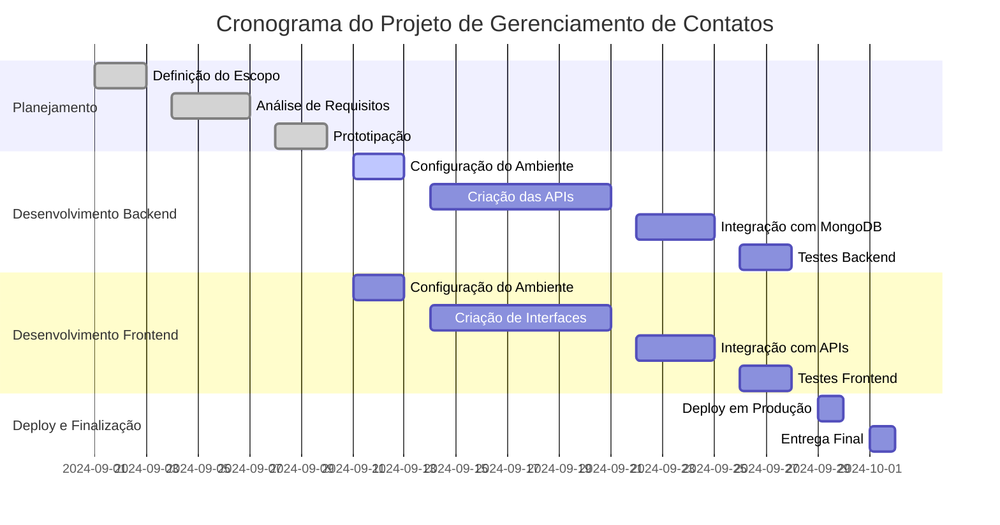
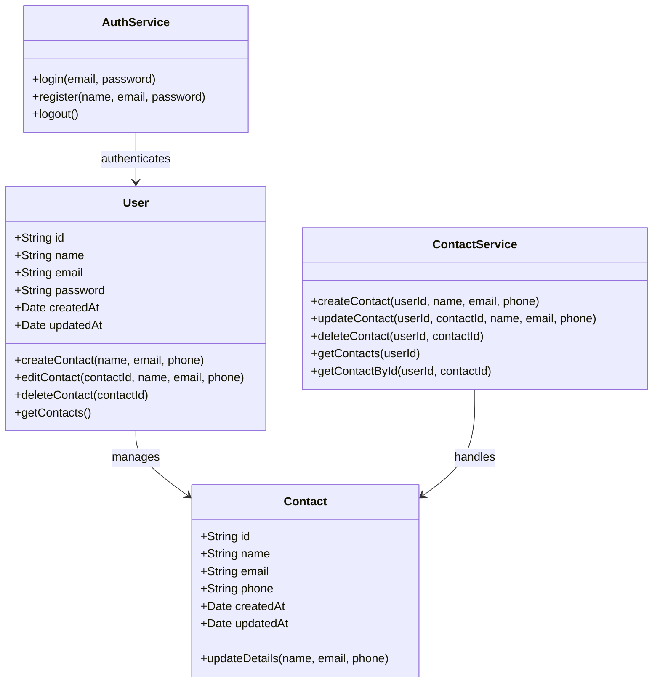
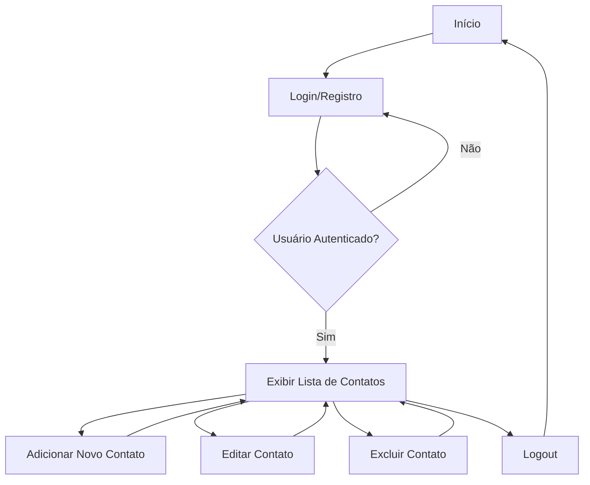

# Sistema de Gerenciamento de Contatos

## 1. O que Vamos Fazer
Desenvolver um sistema para gerenciamento de contatos, permitindo a criação, leitura, atualização e exclusão de contatos pessoais e profissionais. O projeto será desenvolvido com Node.js no backend e React no frontend.

## 2. Escopo Funcional
### Funcionalidades Principais:
- **Listar Contatos:** Exibir todos os contatos armazenados no banco de dados.
- **Adicionar Contato:** Permitir ao usuário criar um novo contato com nome, e-mail e telefone.
- **Atualizar Contato:** Editar as informações de um contato existente.
- **Excluir Contato:** Remover um contato da lista.

## 3. Escopo Não Funcional
### Qualidade e Desempenho:
- **Responsividade:** O sistema será otimizado para dispositivos móveis.
- **Segurança:** Implementar autenticação de usuários e proteção de dados.
- **Escalabilidade:** Arquitetura escalável para adição de novas funcionalidades.
- **Usabilidade:** Interface intuitiva e fácil de usar para gerenciar os contatos.

## 4. Objetivos SMART
- **Específico:** Criar um sistema de gerenciamento de contatos com operações CRUD.
- **Mensurável:** O sistema deve suportar pelo menos 1000 contatos sem perda de desempenho.
- **Atingível:** Desenvolvido por uma equipe de 2 desenvolvedores com experiência em Node.js e React.
- **Relevante:** O gerenciamento de contatos é uma necessidade essencial para usuários de diferentes setores.
- **Temporal:** O projeto será concluído em 10 semanas.

## 5. Cronograma
### Diagrama de Gantt


## 6. Análise de Risco

### Possíveis Riscos:
- **Problemas de Integração:** Dificuldades na comunicação entre o frontend e o backend.
- **Atraso no Cronograma:** Possibilidade de atrasos no desenvolvimento do backend devido a desafios imprevistos.
- **Problemas de Escalabilidade:** Dificuldade em gerenciar um grande número de contatos no banco de dados.
- **Falhas de Segurança:** Vulnerabilidades que podem levar ao vazamento de dados dos usuários.

### Estratégias de Mitigação:
- **Problemas de Integração:** Realizar testes de integração continuamente durante o desenvolvimento para identificar e corrigir erros o mais rápido possível.
- **Atraso no Cronograma:** Monitorar o progresso semanalmente e ajustar os prazos conforme necessário.
- **Problemas de Escalabilidade:** Utilizar boas práticas no desenvolvimento e na modelagem de dados com MongoDB.
- **Falhas de Segurança:** Implementar autenticação robusta e criptografia de dados sensíveis, além de seguir boas práticas de segurança.

## 7. Recursos

### Recursos Humanos:
- **Desenvolvedor Backend:** Responsável por criar as APIs e realizar a integração com o banco de dados MongoDB.
- **Desenvolvedor Frontend:** Responsável pela criação das interfaces de usuário em React e pela integração com o backend.

### Recursos Tecnológicos:
- **Node.js:** Plataforma para o desenvolvimento do servidor backend.
- **Express:** Framework Node.js para desenvolvimento de APIs RESTful.
- **MongoDB:** Banco de dados NoSQL utilizado para armazenar os contatos.
- **Mongoose:** Biblioteca para modelar dados MongoDB em Node.js.
- **React:** Framework JavaScript utilizado no desenvolvimento da interface do usuário.
- **Axios:** Biblioteca HTTP para realizar requisições entre o frontend e o backend.
  
## 8. Observações

Este documento de escopo é uma versão inicial e está sujeito a atualizações conforme o projeto avança. Mudanças no cronograma, funcionalidades e recursos serão ajustadas de acordo com o progresso do desenvolvimento e novos requisitos que possam surgir.

### Diagrama de Classes

```


### Diagrama de Fluxo

```
