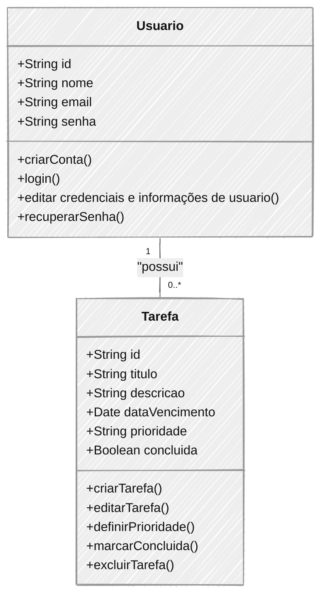

# Escopo do Projeto: Aplicação To-Do List

## Visão Geral

Este documento detalha o escopo do projeto de desenvolvimento de uma aplicação web de To-Do List. A aplicação será construída utilizando Node.js, React, MongoDB e JWT, e visa proporcionar uma solução robusta, segura e escalável para o gerenciamento de tarefas. A aplicação será utilizada pelos colaboradores da Escola SENAI para organizar e priorizar suas atividades diárias.

## Objetivo

O objetivo principal deste projeto é desenvolver uma aplicação de To-Do List que permita aos colaboradores da Escola SENAI gerenciar suas tarefas de maneira eficiente. A aplicação oferecerá recursos de criação, edição, exclusão e marcação de tarefas como concluídas, garantindo uma interface intuitiva e responsiva.

## Escopo Funcional

### Funcionalidades Principais

1. **Cadastro de Usuário**:

   - Usuários poderão criar uma conta na aplicação utilizando um endereço de e-mail válido.
   - O sistema deve enviar um e-mail de confirmação para validar o cadastro.

2. **Autenticação com JWT**:

   - Implementar um sistema de login seguro utilizando JSON Web Tokens (JWT).
   - Garantir que o JWT expire após um determinado período de inatividade para aumentar a segurança.
   - Implementar funcionalidades de "lembrar-me" e recuperação de senha.

3. **Gerenciamento de Tarefas**:

   - **Criação de Tarefas**: Usuários poderão criar novas tarefas, especificando título, descrição, data de vencimento e prioridade.
   - **Edição de Tarefas**: Tarefas existentes podem ser editadas a qualquer momento para refletir mudanças.
   - **Marcação de Tarefas como Concluídas**: Os usuários podem marcar tarefas como concluídas, que serão movidas para uma lista separada.
   - **Exclusão de Tarefas**: Tarefas podem ser removidas definitivamente pelo usuário.

4. **Filtros e Ordenação**:

   - Usuários poderão filtrar tarefas por status (concluída ou pendente), prioridade (alta, média, baixa), e data de vencimento.
   - Implementar funcionalidades de ordenação para facilitar a visualização das tarefas mais importantes ou urgentes.

5. **Interface Responsiva**:
   - Garantir que a aplicação seja responsiva e funcione corretamente em dispositivos móveis, tablets e desktops.
   - Utilizar práticas de design responsivo, como media queries e layout flexível, para proporcionar uma experiência de usuário consistente.

## Escopo Não Funcional

### Qualidade do Sistema

1. **Segurança**:

   - Implementar criptografia de dados sensíveis, como senhas e tokens de autenticação, utilizando técnicas como bcrypt e HTTPS.
   - Configurar medidas de segurança contra ataques comuns, como SQL Injection, Cross-Site Scripting (XSS) e Cross-Site Request Forgery (CSRF).

2. **Escalabilidade**:

   - Planejar a arquitetura do sistema para suportar o crescimento do número de usuários e tarefas.
   - Implementar práticas de código que favoreçam a escalabilidade, como a divisão do backend em microserviços, se necessário.

3. **Desempenho**:

   - O tempo de resposta das operações da aplicação deve ser inferior a 2 segundos.
   - Otimizar o carregamento de dados e minimizar as requisições ao servidor utilizando técnicas de cache e lazy loading.

4. **Manutenibilidade**:
   - Escrever código modular e reutilizável, com padrões de nomenclatura claros e consistentes.
   - Documentar cada módulo do código para facilitar a manutenção futura e garantir que novos desenvolvedores possam entender o projeto rapidamente.

### Requisitos Técnicos

1. **Frontend**: Desenvolvido em React.js com o uso de hooks e context API para gerenciamento de estado.
2. **Backend**: Construído com Node.js e Express.js, utilizando arquitetura RESTful para comunicação com o frontend.
3. **Banco de Dados**: MongoDB será utilizado para armazenar os dados dos usuários e tarefas, com o uso de Mongoose para modelagem dos dados.
4. **Autenticação**: Gerenciada através de JSON Web Token (JWT), com suporte para renovação automática e revogação.
5. **Hospedagem**: A aplicação será hospedada em uma plataforma de nuvem, como Heroku ou AWS, com suporte para Continuous Integration/Continuous Deployment (CI/CD).

## Objetivos SMART

1. **Específico**: Desenvolver uma aplicação de To-Do List que permita aos usuários gerenciar suas tarefas diárias, com funcionalidades de criação, edição, exclusão e marcação de tarefas.
2. **Mensurável**: A aplicação deve suportar até 1000 usuários simultâneos, e o tempo de carregamento das páginas deve ser inferior a 2 segundos.
3. **Atingível**: O projeto será desenvolvido em 3 meses, utilizando as tecnologias e frameworks mencionados, com um cronograma de desenvolvimento dividido em sprints quinzenais.
4. **Relevante**: A aplicação visa melhorar a eficiência e organização dos colaboradores da Escola SENAI, proporcionando uma ferramenta útil para o dia a dia.
5. **Temporal**: O projeto deverá ser concluído e entregue até o dia [Data específica, por exemplo, 30 de novembro de 2024].

## Cronograma

O cronograma do projeto será gerido utilizando um diagrama de Gantt, que está disponível no repositório GitHub do projeto. Este cronograma detalha as etapas de desenvolvimento, desde a prototipagem até a entrega final. [Link para o Gantt]

## Análise de Risco

1. **Risco 1**: Atraso na integração entre backend e frontend devido à complexidade das APIs.
   - **Mitigação**: Estabelecer checkpoints semanais para monitorar o progresso e resolver problemas de integração rapidamente.
2. **Risco 2**: Desafios de escalabilidade ao aumentar o número de usuários e tarefas simultâneas.
   - **Mitigação**: Realizar testes de carga e otimizar o código e as consultas ao banco de dados para garantir que o sistema possa escalar conforme necessário.
3. **Risco 3**: Possíveis problemas de segurança, como vazamento de dados ou falhas de autenticação.
   - **Mitigação**: Implementar uma auditoria de segurança durante o desenvolvimento, e realizar testes de penetração antes da entrega.

## Recursos

### Equipe

- **Desenvolvedor Backend**: Responsável pela criação das APIs, integração com o banco de dados e implementação de segurança.
- **Desenvolvedor Frontend**: Responsável pelo desenvolvimento da interface de usuário em React e pela integração com as APIs.
- **Designer UX/UI**: Responsável pela criação de wireframes, mockups e pela definição da experiência do usuário.
- **Gerente de Projeto**: Responsável por coordenar a equipe, garantir que o cronograma seja seguido e que os objetivos do projeto sejam alcançados.

### Ferramentas

- **IDE**: Visual Studio Code será utilizado como o ambiente de desenvolvimento integrado.
- **Controle de Versão**: Git e GitHub serão usados para versionamento de código e colaboração entre os membros da equipe.
- **Comunicação**: Slack e Trello serão utilizados para comunicação e gestão de tarefas.
- **Documentação**: Notion e Markdown serão utilizados para documentar o progresso do projeto, decisões tomadas e resultados alcançados.

## Resultado Esperado

O resultado esperado é a entrega de uma aplicação funcional de To-Do List, pronta para uso pelos colaboradores da Escola SENAI. A aplicação deverá ser intuitiva, responsiva, segura e escalável, com toda a documentação e código-fonte devidamente organizados e disponibilizados no GitHub do projeto. A entrega final incluirá:

- Código-fonte completo da aplicação.
- Documentação técnica detalhada.
- Testes unitários e de integração.
- Diagrama de classes, casos de uso e fluxo.
- Protótipos e wireframes utilizados durante o desenvolvimento.

---

### Diagramas de Classes

### Diagrama de Casos de Uso

### Diagrama de Fluxo

### Cronograma

---

**Aluno:** Maycon Vitor Correa

**Curso:** Desenvolvimento de Sistemas (Noite)

**Professor:** Diogo

**Data de Entrega:** 30/08/2024
